mongo db

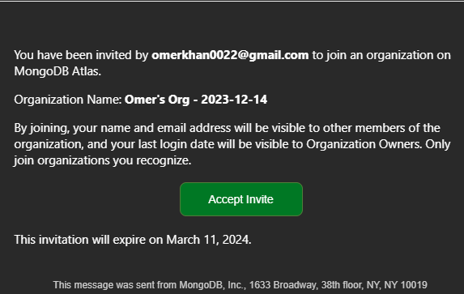

create an account with email that you gave Omer to use

[https://cloud.mongodb.com/v2/65c421e2e87531567bc4d7b2\#/clusters/detail/SmartPawsDB](https://cloud.mongodb.com/v2/65c421e2e87531567bc4d7b2#/clusters/detail/SmartPawsDB)

add ip address to network access

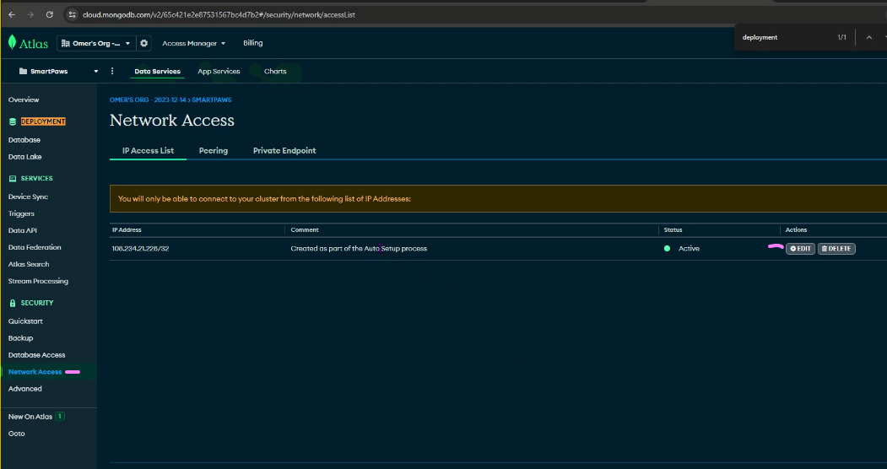

click ADD CURRENT IP ADDRESS (mine was different than what I saw on my computer but just go with it)

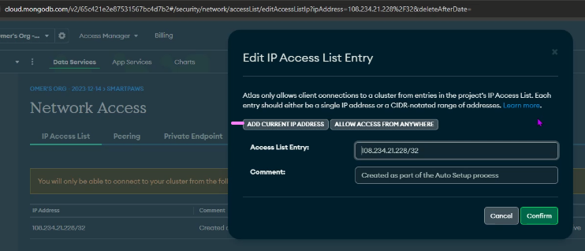

firebase

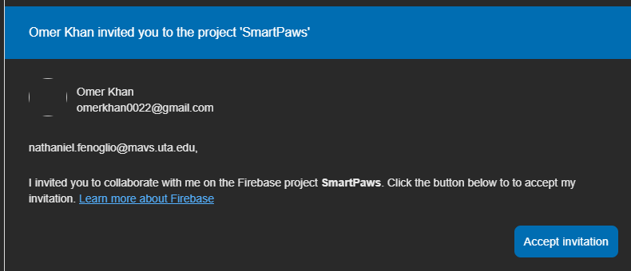

set up a google account with email that you gave Omer to use

<https://console.firebase.google.com/u/3/project/smartpaws-737b0/overview>

github

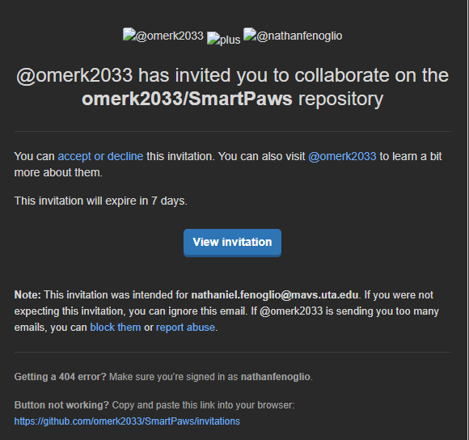

install node.js on your computer if you haven't already

<https://nodejs.org/en/download>

Clone git repo in whatever directory you want on your computer

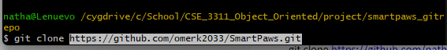

go into both directories and run npm install in each

cd into SmartPawsFrontend

npm install

front end

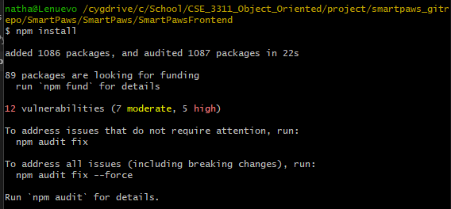

cd into SmartPawsBackend

npm install

back end

THINGS TO CHANGE IN CODE

add file ".env" to SmartPawsBackend

SmartPawsBackend/.env

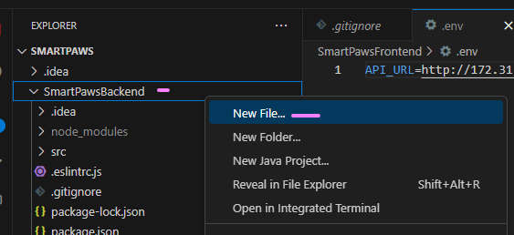

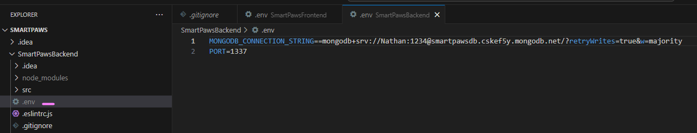

change (well creating a new file so just add the 2 lines)

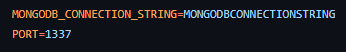

to (with your mongodb and password)

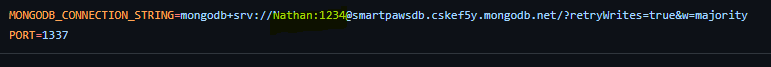

SmartPawsFrontend/src/.env

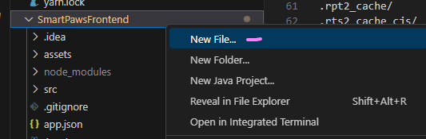

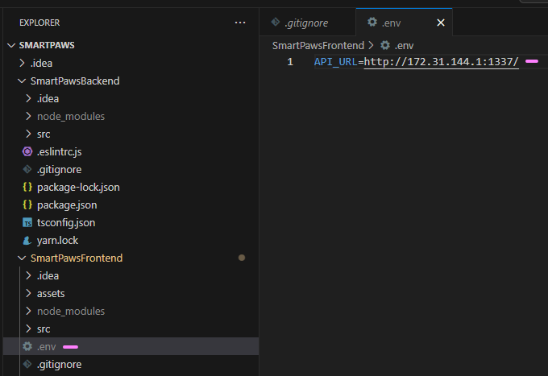

change (well creating a new file so just add the line)

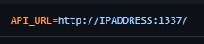

to (your ip address on your computer (ipconfig))

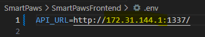

RUNNING APP

download expo go on your phone (can search for it in app store or google play)

this will let you scan a qr code to be able to debug on your phone

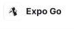

or could also use emulator on your computer using android studio to debug on computer

start backend server

cd into SmartPawsBackend

npm start

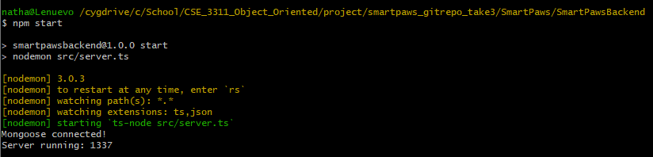

start frontend

in another terminal window

cd into SmartPawsFrontend

npx expo start

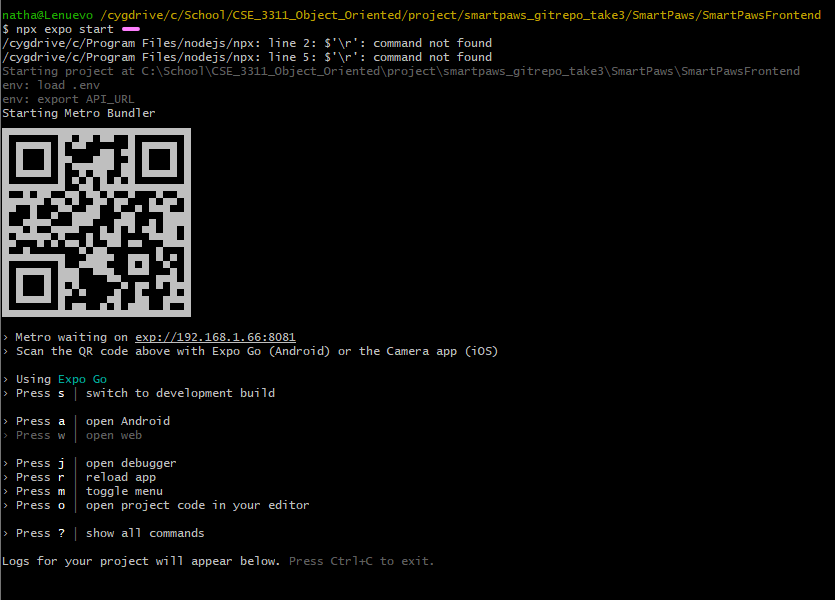

open expo go on phone

select "Scan QR code" and scan QR code from terminal

should open app on phone

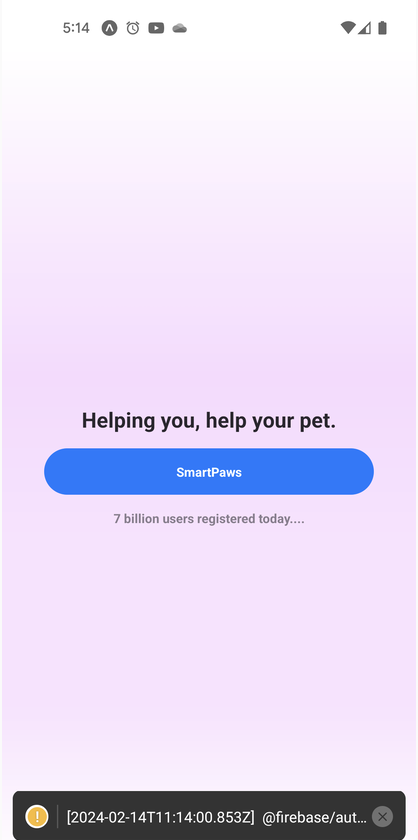

Click SmartPaws button and register a new user and will be registered and able to be viewed in the Firebase console and MongoDB console

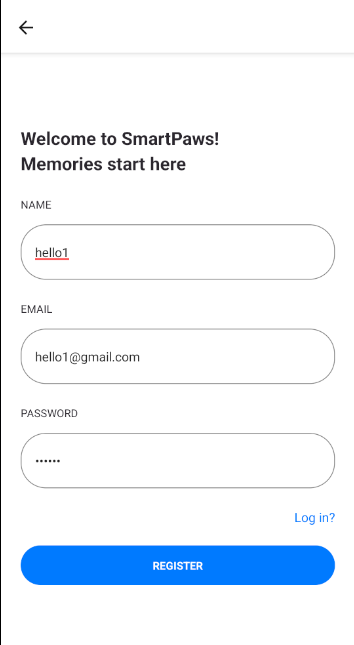

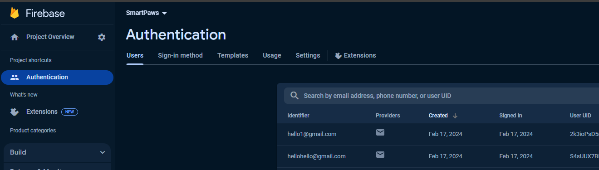

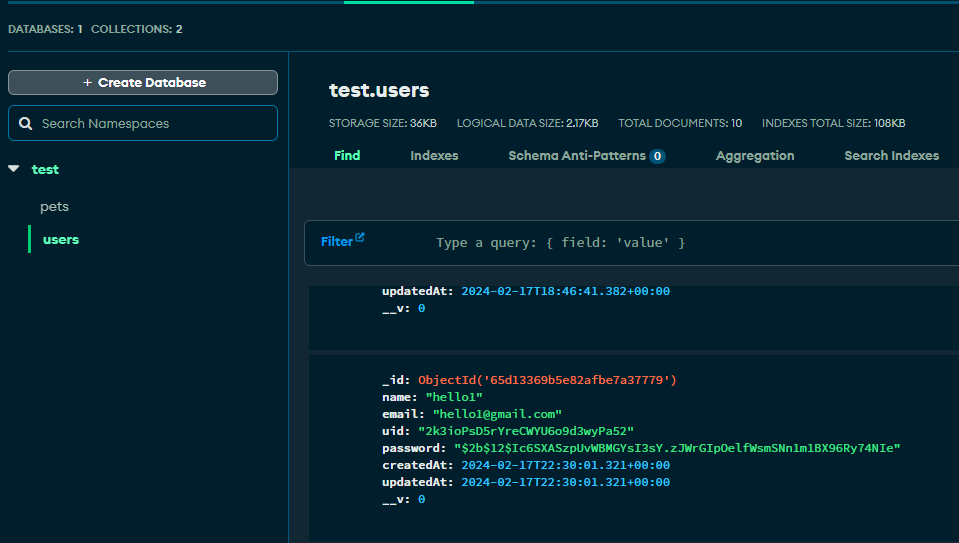

Login with previously registered user’s credentials

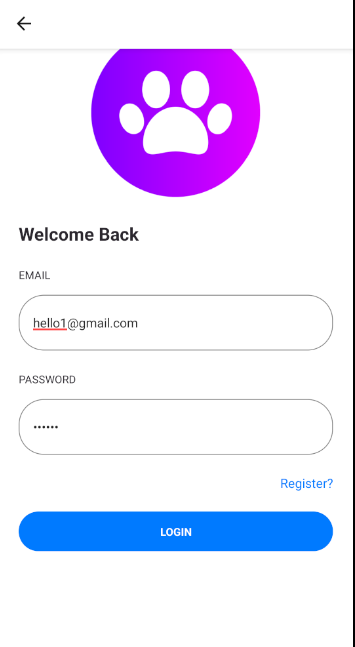

Register new pet for logged in user

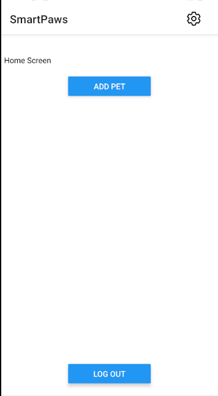

Verify that pet has been saved in MongoDB console

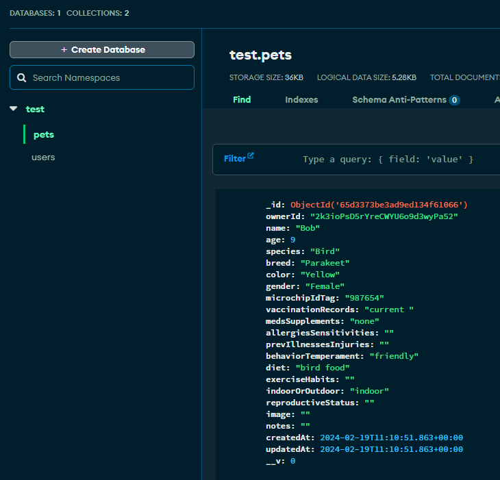
